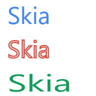
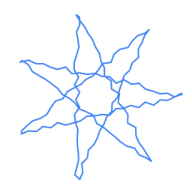
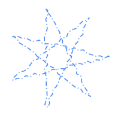
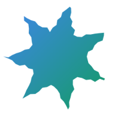

# Skia4Delphi

[](https://www.embarcadero.com/products/delphi) [](http://docwiki.embarcadero.com/PlatformStatus/en/Main_Page) [](http://docwiki.embarcadero.com/PlatformStatus/en/Main_Page)

**Skia4Delphi** is a cross-platform 2D graphics API for Delphi based on Google's Skia Graphics Library ([skia.org](https://skia.org/)).

Google's Skia Graphics Library serves as the graphics engine for Google Chrome and Chrome OS, Android, Flutter, Xamarin, Mozilla Firefox and Firefox OS, and many other products.


## Motivation

Skia is a great open source library for drawing 2D Text, Geometries, Images, focused on accurate, high quality and high performance rendering, which provides common APIs that work across a variety of hardware and software platforms.


## Links

* [Library Linking](#library-linking)
* [Documentation](#documentation)
* [Basic Usage](#basic-usage)
* [Text Shaping](#text-shaping)
* [PDF/SVG](#pdfsvg)
* [Skottie (Lottie Animation Player)](#skottie-lottie-animation-player)
* [Firemonkey Adaptation](#firemonkey-adaptation)
* [Stream Adaptation](#stream-adaptation)
* [Debug](#debug)
* [Version](#version)
* [Build](./BUILD.md)


## Library Linking

The library is static on iOS, and shared on other platforms. By default the shared library is loaded at run-time, however you can link it at compile-time by defining **SK_DYNAMIC_LINKING** and adding the library binary directory to the project's library path. You can [build the skia binaries yourself](./BUILD.md), or use the already [compiled binaries we provide](./tags).

### Windows/Linux

Copy the **.dll** or **.so** file to the same application folder or any folder that is listed in the PATH environment variable.

### iOS

1. Choose from the main menu: **Project > Options...**;
2. Access **Building > Delphi Compiler**;
3. Select **All configurations - iOS Device 64-bit platform**;
4. Add **.\static\iOSDevice64** path to **Search Path**;
5. Now access **Building > Delphi Compiler > Linking**;
6. Add **-lc++** flag to **Options passed to the LD linker**;
7. Click **Save**.

### macOS

1. Choose from the main menu: **Project > Deployment**;
2. Select **Debug configuration - macOS 64-bit platform**;
3. Click **Add Files** and select **shared\OSX64\sk4d.dylib**;
4. Change the **Remote Path** column to **Contents\MacOS\\**;
5. Repeat numbers 2, 3 and 4, this time selecting the <u>release</u> configuration;
6. Close Deployment.

### Android

1. Choose from the main menu: **Project > Deployment**;
2. Select **Debug configuration - Android 32-bit platform**;
3. Click **Add Files** and select **shared\Android\sk4d.so**;
4. Change the **Remote Path** column to **library\lib\armeabi-v7a\\**;
5. Repeat numbers 2, 3 and 4, this time selecting the <u>release</u> configuration;
6. Now select **Debug configuration - Android 64-bit platform**;
7. Click **Add Files** and select **shared\Android64\sk4d.so**;
8. Change the **Remote Path** column to **library\lib\arm64-v8a\\**;
9. Repeat numbers 6, 7 and 8, this time selecting the <u>release</u> configuration;
10. Close Deployment.


## Documentation

The APIs are very similar to Skia's, few methods and functions have been renamed for readability, so the [Skia documentation](https://skia.org/docs/) can be used.

### Remarks

- Skia's Stream and WStream classes can be used with the native TStream using respectively the TSKStreamAdapter and TSKWStreamAdapter classes;
- Some APIs were not exposed, some because they are deprecated.


## Basic Usage

The code below is common code among all the examples in this section:

```pascal
var
  LImage: ISKImage;
  LSurface: ISKSurface;
begin
  LSurface := TSKSurface.MakeRaster(256, 256);
  Draw(LSurface.Canvas);
  LImage := LSurface.MakeImageSnapshot;
  LImage.EncodeToFile('output.png', TSKEncodedImageFormat.PNG);
end;
```

### Shapes

```pascal
procedure Draw(const ACanvas: ISKCanvas);
var
  LOval: ISKRoundRect;
  LPaint: ISKPaint;
  LRect: TRectF;
begin
  ACanvas.DrawColor(TAlphaColors.White);

  LPaint := TSKPaint.Create;
  LPaint.Style := TSKPaintStyle.Fill;
  LPaint.AntiAlias := True;
  LPaint.StrokeWidth := 4;
  LPaint.Color := $ff4285F4;

  LRect := TRectF.Create(TPointF.Create(10, 10), 100, 160);
  ACanvas.DrawRect(LRect, LPaint);

  LOval := TSKRoundRect.Create;
  LOval.SetOval(LRect);
  LOval.Offset(40, 80);
  LPaint.Color := $ffDB4437;
  ACanvas.DrawRoundRect(LOval, LPaint);

  LPaint.Color := $ff0F9D58;
  ACanvas.DrawCircle(180, 50, 25, LPaint);

  LRect.Offset(80, 50);
  LPaint.Color := $ffF4B400;
  LPaint.Style := TSKPaintStyle.Stroke;
  ACanvas.DrawRoundRect(LRect, 10, 10, LPaint);
end;
```

This code results in the output below:


### Bézier Curves

```pascal
procedure Draw(const ACanvas: ISKCanvas);
var
  LPaint: ISKPaint;
  LPath: ISKPath;
  LPathBuilder: ISKPathBuilder;
begin
  ACanvas.DrawColor(TAlphaColors.White);

  LPaint := TSKPaint.Create;
  LPaint.Style := TSKPaintStyle.Stroke;
  LPaint.StrokeWidth := 8;
  LPaint.Color := $ff4285F4;
  LPaint.AntiAlias := True;
  LPaint.StrokeCap := TSKStrokeCap.Round;

  LPathBuilder := TSKPathBuilder.Create;
  LPathBuilder.MoveTo(10, 10);
  LPathBuilder.QuadTo(256, 64, 128, 128);
  LPathBuilder.QuadTo(10, 192, 250, 250);
  LPath := LPathBuilder.Detach;
  ACanvas.DrawPath(LPath, LPaint);
end;
```

This code results in the output below:


### Translations and Rotations

```pascal
procedure Draw(const ACanvas: ISKCanvas);
var
  LPaint: ISKPaint;
  LRect: TRectF;
begin
  ACanvas.DrawColor(TAlphaColors.White);

  ACanvas.Translate(128, 0);
  ACanvas.Rotate(60);
  LRect := TRectF.Create(TPointF.Create(0, 0), 200, 100);

  LPaint := TSKPaint.Create;
  LPaint.AntiAlias := True;
  LPaint.Color := $ff4285F4;
  ACanvas.DrawRect(LRect, LPaint);

  ACanvas.Rotate(20);
  LPaint.Color := $ffDB4437;
  ACanvas.DrawRect(LRect, LPaint);
end;
```

This code results in the output below:


### Text Rendering

```pascal
procedure Draw(const ACanvas: ISKCanvas);
var
  LBlob1: ISKTextBlob;
  LBlob2: ISKTextBlob;
  LFont1: ISKFont;
  LFont2: ISKFont;
  LPaint1: ISKPaint;
  LPaint2: ISKPaint;
  LPaint3: ISKPaint;
  LTypeface: ISKTypeface;
begin
  LTypeface := TSKTypeface.MakeFromName('Monospace', TSKFontStyle.Normal);
  LFont1 := TSKFont.Create(LTypeface, 64, 1);
  LFont2 := TSKFont.Create(LTypeface, 64, 1.5);
  LFont1.Edging := TSKFontEdging.AntiAlias;
  LFont2.Edging := TSKFontEdging.AntiAlias;

  LBlob1 := TSKTextBlob.Make('Skia', LFont1);
  LBlob2 := TSKTextBlob.Make('Skia', LFont2);


  LPaint1 := TSKPaint.Create;
  LPaint1.AntiAlias := True;
  LPaint1.SetARGB($FF, $42, $85, $F4);

  LPaint2 := TSKPaint.Create;
  LPaint2.AntiAlias := True;
  LPaint2.SetARGB($FF, $DB, $44, $37);
  LPaint2.Style := TSKPaintStyle.Stroke;
  LPaint2.StrokeWidth := 3;

  LPaint3 := TSKPaint.Create;
  LPaint3.AntiAlias := True;
  LPaint3.SetARGB($FF, $0F, $9D, $58);

  ACanvas.Clear(TAlphaColors.White);
  ACanvas.DrawTextBlob(LBlob1, 20, 64, LPaint1);
  ACanvas.DrawSimpleText('Skia', 20, 154, LFont1, LPaint2);
  ACanvas.DrawTextBlob(LBlob2, 20, 244, LPaint3);
end;
```

This code results in the output below:



### Discrete Path Effects

```pascal
function Star: ISKPath;
var
  I: Integer;
  LA: Single;
  LC: Single;
  LPathBuilder: ISKPathBuilder;
  LR: Single;
begin
  LR := 115.2;
  LC := 128.0;
  LPathBuilder := TSKPathBuilder.Create;
  LPathBuilder.MoveTo(LC + LR, LC);
  for I := 1 to 7 do
  begin
    LA := 2.6927937 * I;
    LPathBuilder.LineTo(LC + LR * Cos(LA), LC + LR * Sin(LA));
  end;
  Result := LPathBuilder.Detach;
end;

procedure Draw(const ACanvas: ISKCanvas);
var
  LPaint: ISKPaint;
  LPath: ISKPath;
begin
  LPaint := TSKPaint.Create;
  LPaint.PathEffect := TSKPathEffect.MakeDiscrete(10, 4);
  LPaint.Style := TSKPaintStyle.Stroke;
  LPaint.StrokeWidth := 2;
  LPaint.AntiAlias := True;
  LPaint.Color := $ff4285F4;
  ACanvas.Clear(TAlphaColors.White);
  LPath := Star;
  ACanvas.DrawPath(LPath, LPaint);
end;
```

This code results in the output below:



### Composed Path Effects

```pascal
function Star: ISKPath;
var
  I: Integer;
  LA: Single;
  LC: Single;
  LPathBuilder: ISKPathBuilder;
  LR: Single;
begin
  LR := 115.2;
  LC := 128.0;
  LPathBuilder := TSKPathBuilder.Create;
  LPathBuilder.MoveTo(LC + LR, LC);
  for I := 1 to 7 do
  begin
    LA := 2.6927937 * I;
    LPathBuilder.LineTo(LC + LR * Cos(LA), LC + LR * Sin(LA));
  end;
  Result := LPathBuilder.Detach;
end;

procedure Draw(const ACanvas: ISKCanvas);
var
  LPaint: ISKPaint;
  LPath: ISKPath;
  LIntervals: TArray<Single>;
  LDashPathEffect: ISKPathEffect;
  LDiscretePathEffect: ISKPathEffect;
begin
  LIntervals := [10, 5, 2, 5];
  LDashPathEffect := TSKPathEffect.MakeDash(LIntervals, 0);
  LDiscretePathEffect := TSKPathEffect.MakeDiscrete(10, 4);
  LPaint := TSKPaint.Create;
  LPaint.PathEffect := TSKPathEffect.MakeCompose(LDashPathEffect, LDiscretePathEffect);
  LPaint.Style := TSKPaintStyle.Stroke;
  LPaint.StrokeWidth := 2;
  LPaint.AntiAlias := True;
  LPaint.Color := $ff4285F4;
  ACanvas.Clear(TAlphaColors.White);
  LPath := Star;
  ACanvas.DrawPath(LPath, LPaint);
end;
```

This code results in the output below:



### Sum Path Effects

```pascal
function Star: ISKPath;
var
  I: Integer;
  LA: Single;
  LC: Single;
  LPathBuilder: ISKPathBuilder;
  LR: Single;
begin
  LR := 115.2;
  LC := 128.0;
  LPathBuilder := TSKPathBuilder.Create;
  LPathBuilder.MoveTo(LC + LR, LC);
  for I := 1 to 7 do
  begin
    LA := 2.6927937 * I;
    LPathBuilder.LineTo(LC + LR * Cos(LA), LC + LR * Sin(LA));
  end;
  Result := LPathBuilder.Detach;
end;

procedure Draw(const ACanvas: ISKCanvas);
var
  LPaint: ISKPaint;
  LPath: ISKPath;
  LIntervals: TArray<Single>;
  LDashPathEffect1: ISKPathEffect;
  LDashPathEffect2: ISKPathEffect;
begin
  LIntervals := [10, 5, 2, 5];
  LDashPathEffect1 := TSKPathEffect.MakeDiscrete(10, 4);
  LDashPathEffect2 := TSKPathEffect.MakeDiscrete(10, 4, 1245);
  LPaint := TSKPaint.Create;
  LPaint.PathEffect := TSKPathEffect.MakeSum(LDashPathEffect1, LDashPathEffect2);
  LPaint.Style := TSKPaintStyle.Stroke;
  LPaint.StrokeWidth := 2;
  LPaint.AntiAlias := True;
  LPaint.Color := $ff4285F4;
  ACanvas.Clear(TAlphaColors.White);
  LPath := Star;
  ACanvas.DrawPath(LPath, LPaint);
end;
```

This code results in the output below:


### Shaders

```pascal
function Star: ISKPath;
var
  I: Integer;
  LA: Single;
  LC: Single;
  LPathBuilder: ISKPathBuilder;
  LR: Single;
  LR2: Single;
begin
  LR := 60;
  LC := 128.0;
  LPathBuilder := TSKPathBuilder.Create;
  LPathBuilder.MoveTo(LC + LR, LC);
  for I := 1 to 14 do
  begin
    LA := 0.44879895 * I;
    LR2 := LR + LR * (I mod 2);
    LPathBuilder.LineTo(LC + LR2 * Cos(LA), LC + LR2 * Sin(LA));
  end;
  Result := LPathBuilder.Detach;
end;

procedure Draw(const ACanvas: ISKCanvas);
var
  LPaint: ISKPaint;
  LPath: ISKPath;
begin
  LPaint := TSKPaint.Create;
  LPaint.PathEffect := TSKPathEffect.MakeDiscrete(10, 4);
  LPaint.Shader := TSKShader.MakeGradientLinear(TPointF.Create(0, 0), TPointF.Create(256, 256), [$ff4285F4, $ff0F9D58], TSKTileMode.Clamp);
  LPaint.AntiAlias := True;
  ACanvas.Clear(TAlphaColors.White);
  LPath := Star;
  ACanvas.DrawPath(LPath, LPaint);
end;
```

This code results in the output below:




## Text Shaping

The example below demonstrates how to render a Persian sentence using a text-shaping engine:

```pascal
var
  LBlob: ISKTextBlob;
  LFont: ISKFont;
  LImage: ISKImage;
  LPaint: ISKPaint;
  LRunHandler: ISKTextBlobBuilderRunHandler;
  LShaper: ISKShaper;
  LSurface: ISKSurface;
  LText: UTF8String;
begin
  LSurface := TSKSurface.MakeRaster(192, 60);

  LFont := TSKFont.Create(TSKTypeface.MakeDefault, 35, 1);

  LText := 'سلام دنیا!';

  LRunHandler := TSKTextBlobBuilderRunHandler.Create(LText, TPointF.Create(0, 0));
  LShaper := TSKShaper.Create;
  LShaper.Shape(LText, LFont, True, MaxSingle, LRunHandler);
  LBlob := LRunHandler.Detach;

  LPaint := TSKPaint.Create;
  LPaint.AntiAlias := True;
  LPaint.Color := TAlphaColors.Tomato;

  LSurface.Canvas.Clear(TAlphaColors.White);
  LSurface.Canvas.DrawTextBlob(LBlob, 0, 0, LPaint);

  LImage := LSurface.MakeImageSnapshot;
  LImage.EncodeToFile('output.png', TSKEncodedImageFormat.PNG);
end;
```

This code results in the output below:


## PDF/SVG

The example below demonstrates how to load an SVG file and draw it into a PDF file:

```pascal
var
  LCanvas: ISKCanvas;
  LDocument: ISKDocument;
  LDOM: ISKSVGDOM;
  LPDFStream: ISKWStream;
  LSize: TSizeF;
  LSVGStream: ISKStream;
begin
  LSVGStream := TSKFileStream.Create('assets/samples/porsche.svg');
  LDOM := TSKSVGDOM.Make(LSVGStream);
  LSize := LDOM.Root.GetIntrinsicSize(TSizeF.Create(0, 0));

  LPDFStream := TSKFileWStream.Create('output.pdf');
  LDocument := TSKDocument.MakePDF(LPDFStream);
  try
    LCanvas := LDocument.BeginPage(LSize.Width, LSize.Height);
    try
      LDOM.Render(LCanvas);
    finally
      LDocument.EndPage;
    end;
  finally
    LDocument.Close;
  end;
end;
```

The **assets/samples/porsche.svg** file animation results in the output below:


## Skottie (Lottie Animation Player)

The example below demonstrates how to render **one frame** from a JSON animation:


```pascal
var
  LJsonFile: ISKStream;
begin
  LJsonFile := TSKFileStream.Create('assets/samples/rocket.json');
  LAnimation := TSKSkottieAnimation.MakeFromStream(LJsonfile);
  LAnimation.SeekFrameTime(0.5);
  LAnimation.Render(ACanvas, ARect);
```

The **assets/samples/rocket.json** file animation results in the output below:


## Firemonkey Adaptation

It is possible to edit TBitmap (FMX.Graphics.TBitmap) with Skia's Canvas using the code below:

```pascal
var
  LColorType: TSKColorType;
  LData: TBitmapData;
  LImageInfo: TSKImageInfo;
  LSurface: ISKSurface;
begin
  case ABitmap.PixelFormat of
    TPixelFormat.RGBA: LColorType := TSKColorType.RGBA8888;
    TPixelFormat.BGRA: LColorType := TSKColorType.BGRA8888;
  else
    raise Exception.Create('Invalid pixelformat.');
  end;
  LImageInfo:= TSKImageInfo.Create(ABitmap.Width, ABitmap.Height, LColorType);
  if ABitmap.Map(TMapAccess.ReadWrite, LData) then
    try
      LSurface := TSKSurface.MakeRasterDirect(LImageInfo, LData.Data, LData.Pitch);

      // Draw with LSurface.Canvas

    finally
      ABitmap.Unmap(LData);
    end;
end;
```


## Stream Adaptation

It is possible to adapt TStream (System.Classes.TStream) to ISKStream or ISKWStream using the code below:

```pascal
var
  LFileStream: TFileStream;
  LStream: ISKStream;
  LWStream: ISKWStream;
begin
  LFileStream := TFileStream.Create('file.txt', fmOpenRead or fmShareDenyWrite);
  try

    // Stream
    LStream := TSKStreamAdapter.Create(LFileStream);

    // WStream
    LWStream := TSKWStreamAdapter.Create(LFileStream);

  finally
    LFileStream.Free;
  end;
end;
```


## Debug

The **TSkiaObject.DebugMessageProc** global property defines the procedure that intercepts messages sent by Skia's **SkDebugf**. By compiling the Skia library in Debug mode it will be possible to detect bugs easily.


## Version

**Skia4Delphi Version 1.0**

Skia Version used: [canvaskit/0.28.1](https://github.com/google/skia/releases/tag/canvaskit%2F0.28.1)
What has changed from the original code? [Compare.](https://github.com/google/skia/compare/canvaskit/0.28.1...viniciusfbb:main)
